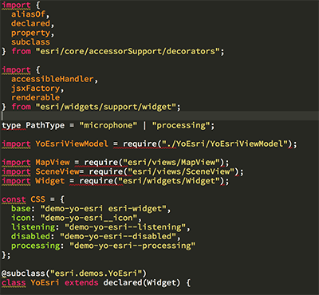

<!-- .slide: data-background="../reveal.js/img/title.png" class="center" -->

# Building Your own Widget with ArcGIS API for JavaScript

### Matt Driscoll – [@driskull](https://twitter.com/driskull)
### JC Franco – [@arfncode](https://twitter.com/arfncode)

---

# Agenda

- About Widgets
- Prerequisites
- Widget framework
- Theming
- DO IT!
- Tips & tricks


---

# About Widgets

- What?
  - Encapsulated
  - Cohesive
  - Single-purpose pieces of functionality
- Why?
  - Reusable
  - Interchangeable
- How?
  - Different frameworks are available

---

# Prerequisites

- Accessor (`esri/core/Accessor`)
- TypeScript


---

## Accessor

- JavaScript API Foundation
- Consistent developer experience
- TypeScript support

---

## Accessor - Unified Object Constructor

```js
var view = new MapView({
  container: "viewDiv",
  map: map
});

var symbol = new SimpleMarkerSymbol({
  style: "square",
  color: "blue"
});

var widget = new BasemapToggle({
  view: view,
  nextBasemap: "hybrid"
});
```

---

## Accessor - Defining Properties (getters + setters)

```js
var Foo = Accessor.createSubclass({
  properties: {

    // read-only
    foo: { readOnly: true, value: new Foo() },

    // aliased
    bar: { aliasOf: "foo" },

    // autocast
    baz: { type: SomeClass }
  }
});
```

---

## Accessor - Property watching

```js
// watch for changes using a property chain
view.watch("map.basemap.title", handleTitleChange);

// watch for changes to multiple properties
view.watch("stationary, interacting", handleViewPropChange);
```

---

# TypeScript

- Superset of JavaScript
- Compiled to JavaScript
- Statically type-checked
- Syntactic sugar... sweet!
  - Use ES6 syntax while targeting ES5 environments


---

# Type safety

```ts
let view: MapView | SceneView;

// ...

/*
 * TS2322: Type '"not-a-view"' is not assignable
 * to type 'MapView | SceneView'.
 */
view = "not-a-view";
```


---

# Typings

Help describe what things are:

```ts
type PresenterName = "Alan" | "Matt" | "JC";

interface Person {
  name: string;
  age: number;
}

interface Presenter extends Person {
  name: PresenterName;
}
```

---

# JS of the future, now

Fat arrow functions

```ts
const someFn = () => { /* ... */ };

// instead of

const someFn = function () { /* ... */ }.bind(this);
```

---

# JS of the future, now

Template strings

```ts
const text = `Hello. Nice to meet you, ${user.name}.`;

// instead of

const text = "Hello. Nice to meet you, " + user.name + ".";
```

---

# JS of the future, now

Destructuring

```ts
const { map, zoom, scale } = view;

// instead of

const map = view.map;
const zoom = view.zoom;
const scale = view.scale;
```

---

# JS of the future, now

Rest Parameters

```ts
function ignoreFirst(first, ...theRest) {
  console.log(theRest);
}

// instead of

function ignoreFirst() {
  var theRest = Array.prototype.slice.call(arguments, 1);

  console.log(theRest);
}
```

---

# JS of the future, now

Decorators

```ts
@log()
foo = "foo";
```

---

# TypeScript IDE Support

- Visual Studio: 2015/2013, Code
- WebStorm
- Sublime Text
- Atom
- Eclipse
- Brackets
- Emacs
- Vim


---

# TypeScript + JS API 4

- Install TypeScript
- Install JavaScript API typings
- Start writing code!

[TypeScript setup](https://developers.arcgis.com/javascript/latest/guide/typescript-setup/index.html)

---

# Let's see some widget decorators


---

# Creating a class

## `@subclass` + `declared`

```ts
@subclass("example.Foo")
class Foo extends declared(Accessor) {
  // ...
}
```

---

# Creating a class: multiple inheritance pattern

## `@subclass` + `declared`

```ts
interface Foo extends Bar, Baz {}

@subclass("example.Foo")
class Foo extends declared(Accessor, Bar, Baz) implements Foo {
  // ...
}
```

---

# Defining a property

## `@property`

```ts
@property()
foo = new Foo();
```

---

# Custom getter/setter

## `@property`

```ts
@property()
set myProperty(value: string) {
  this._set("myProperty", value);
  this._ensureValidity(value);
}
```

---

# Read-only value

## `@property`

```ts
@property({
  readOnly: true
})
myProperty = "I'm read-only";
```

---

# Computed properties

## `@property`

```ts
@property({
  dependsOn: ["firstName, lastName"]
})
get fullName() {
  return `${this.firstName} ${this.lastName}`
}
```

---

# Autocast

## `@property`

```ts
@property({
  type: MyClass
})
myProperty;
```

```
instance.myProperty = { /* params */ };

console.log(instance.myProperty instance of MyClass); // true
```

---

# Alias a property

## `@property`

```
@property({ aliasOf: "bar.baz" })
foo;
```

---

# Alias a property

## `@aliasOf`

```ts
@aliasOf("bar.baz")
foo;
```

---

# Handle click and key events

## `@accessibleHandler`

```ts
@accessibleHandler
private function _doSomething() {
  // ...
}
```

---

# Rendering when properties change

## `@renderable`

```ts
@property()
@renderable()
title = "hello";
```

```ts
@property()
@renderable([
  "viewModel.foo",
  "viewModel.bar"
])
viewModel = new ViewModel();
```

---

# More details in the SDK

 [Implementing Accessor](https://developers.arcgis.com/javascript/latest/guide/implementing-accessor/index.html)
 [Widget Development](https://developers.arcgis.com/javascript/latest/guide/custom-widget/index.html#)

---

# Widget framework

- [JSX](https://facebook.github.io/react/docs/introducing-jsx.html)
- Lifecycle
- Properties
- Methods
- Events

---

# Widget Framework: About

`esri/widgets/Widget`: Our new widget framework

- Accessor-based
- Built with TypeScript


---

# Widget Framework: [JSX](https://facebook.github.io/react/docs/introducing-jsx.html)

- JavaScript extension **syntax**
- preprocessor
- adds XML syntax to JavaScript
- Looks similar to HTML
- Can use JS inline!

```xml
<div class={classLookup.hello}
  onclick={this._handleClick}
  tabIndex={0}>
  Hello World
</div>
```

---

# Widget Framework: Lifecycle

- `constructor()`
- `postInitialize()`
- `render()`
- `destroy()`

---

# `constructor()`

```
constructor(params?: any) {
  super();
  // Do some stuff!
}
```

---

# `postInitialize()`

```
postInitialize() {
  this.own(
    watchUtils.on(this, "property", => this._propertyChanged)
  );
}
```

---

# `render()`

- Return JSX
- Virtual DOM

```
render() {
  return (
    <button>{this.title}</button>
  );
}
```

[Widget rendering (SDK)](https://developers.arcgis.com/javascript/latest/guide/custom-widget/index.html#widget-rendering)

---

# `destroy()`

```
destroy() {
  // cleanup listeners
  // destroy other widgets
  // dereference variables
  // etc.
}
```

---

# Framework: Getting/Setting Properties

```
// normal setting of a prop
myWidget.property = value;
```

```
// normal getting of a prop
console.log(myWidget.property);
```

```
// internal set property
// will not trigger setter
this._set("property", propertyValue);
```

```
// internal get property
// will not trigger getter
this._get("property");
```

---

# Framework: ViewModels

(The brain)

- Core logic of widget resides here
- Provides necessary APIs for the view to do it's thing
- No DOM/UI concerns (think business logic)


---

# ViewModels: Why?

- Framework integration
- Reusability
- Separates concerns

---

# Widget Framework: Views

(The face)

- `esri/widgets/Widget`
- Uses ViewModel APIs to render the UI
- View-specific logic resides here


---

# Views: Why?

- Separates concerns
- Framework compatibility

---

# Views: Defining ViewModel

```
@property({
  type: MyViewModel
})
viewModel: MyViewModel = new MyViewModel();
```

---

# Widget Framework: Methods

Public Methods

```
public myMethod() {}
```

Private Methods

```
private _myMethod() {}
```

---

# Widget Framework: Events

- Views have ability to `emit()` an event.
- ViewModel needs to import `dojo/evented` in order to `emit()`
- Views can alias an event with `vmEvent` decorator.

---

# Widget Framework: View Events

- Widget views extend `esri/core/Evented`

```
this.emit("my-event", {...});
```

---

# Widget Framework: ViewModel Events

#### 1. Import evented

```
import Evented = require("esri/core/Evented");
```

#### 2. Extend Evented

```
interface MyViewModel extends Evented {
  ...
}
```

#### 3. Emit event when necessary
```
this.emit("my-event", {...});
```

---

# Widget Framework: Aliased View Events

```
@vmEvent("my-event")
@property({
  type: MyViewModel
})
viewModel: MyViewModel = new MyViewModel();
```

---

# Widget Theming

- SDK: Styling topic
- Out of the box themes
- [Sass](http://sass-lang.com/)
- [BEM](http://getbem.com/)


---

# Widget Theming: Guide

[SDK Guide: Styles](https://developers.arcgis.com/javascript/latest/guide/styling/index.html)


---

# Widget Theming: Out of the box

[Themes Demo](https://jcfranco.github.io/dev-summit-2017-building-your-own-widget/demos/themes/)


---

# Widget Theming: Sass

- CSS preprocessor
- Variables
- `@mixin` (group statements)
- `@include` - (use mixins)
- `@import` - (split up files)
- `@extend` - (inheritance)
- More power!

<a href="http://sass-lang.com/"></a>

---

# Sass makes it easier to...

- Restyle
- Theme
- Modular / DRY
- Be organized
- Write less code :)


---

# Sass Install

[Installing Sass](http://sass-lang.com/install)

---

# Widget Theming: BEM

- [BEM](http://getbem.com/): Block Element Modifier
- Methodology to create reusable components
- Uses delimiters to separate block, element, modifiers
- Provides semantics (albeit verbose)
- Keeps specificity low
- Scopes styles to blocks

```css
/* block */
.example-widget {}

/* block__element */
.example-widget__input {}
.example-widget__submit {}

/* block--modifier */
.example-widget--loading {}

/* block__element--modifier */
.example-widget__submit--disabled {}
```

---

# DO IT!

Build a widget!


[Demo](http://localhost/projects/dev-summit-2017-building-your-own-widget/demos/yo-esri-complete/)

---

# Setup HTML & CSS with Sass

- [HTML Setup Steps](https://github.com/jcfranco/dev-summit-2017-building-your-own-widget/blob/master/demo-steps/HTML-STEPS.md)
- [Sass Setup Steps](https://github.com/jcfranco/dev-summit-2017-building-your-own-widget/blob/master/demo-steps/SASS-STEPS.md)

---

# Tips & Tricks

- Collections
- Accessibility
- i18n


---

# Rethinking Widget APIs

- Using `esri/core/Collection` instead of Arrays
- Using `esri/core/Accessor` instead of plain objects
- Adding properties to manage widget state
- Hiding nodes with Widget framework JSX instead of CSS
  - setting JSX node to null when necessary
- Private/protected variables

---

# Accessibility

- tabindex
- [aria roles](https://developer.mozilla.org/en-US/docs/Web/Accessibility/ARIA/ARIA_Techniques)
- keyboard events

---

# i18n

Import language file

```js
import * as i18n from "dojo/i18n!./MyWidget/nls/MyWidget";
```

Setup root language file with languages

```js
// "/nls/MyWidget"
define({
  root: ({
    helloWorld: "Hello World"
  }),
  "es": 1
});
```

Setup other languages. (\es\)
```js
// "/nls/es/MyWidget"
define({
  helloWorld: "Hola Mundo"
});
```

---

## Suggested Sessions

- [Building Classes Using Accessor and the ArcGIS API for JavaScript](https://devsummitps17.schedule.esri.com/session-catalog/234004588)
- [Using TypeScript with ArcGIS API for Javascript](https://devsummitps17.schedule.esri.com/session-catalog/685861044)
- [Deep Dive on How ArcGIS API for JavaScript Widgets Were Built](https://devsummitps17.schedule.esri.com/session-catalog/108875117)

---

## Additional Resources

- [Styling](https://developers.arcgis.com/javascript/latest/guide/styling/index.html)
- [Implementing Accessor](https://developers.arcgis.com/javascript/latest/guide/implementing-accessor/index.html)
- [Setting up TypeScript](https://developers.arcgis.com/javascript/latest/guide/typescript-setup/index.html)
- [Widget Development](https://developers.arcgis.com/javascript/latest/guide/custom-widget/index.html)
- [JavaScript Sessions at DevSummit](https://devsummit.schedule.esri.com/#search/sessions/q:javascript)
- [Documentation - 4.3](https://developers.arcgis.com/javascript/)


---

# Use the source luke

## [esriurl.com/buildwidgets2017](http://esriurl.com/buildwidgets2017)

[](http://esriurl.com/buildwidgets2017)

---

# Please Take Our Survey!

1. Download the Esri Events app and go to DevSummit
2. Select the session you attended
3. Scroll down to the "Feedback" section
4. Complete Answers, add a Comment, and Select "Submit"


---

# Questions?


---

# Thank you!


---

<!-- .slide: data-background="../reveal.js/img/end.png" -->
