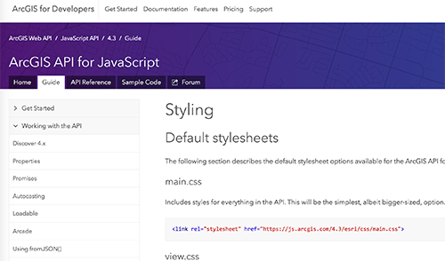

<!-- .slide: data-background="../reveal.js/img/title.png" class="center" -->

# Building Your own Widget with ArcGIS API for JavaScript

### Matt Driscoll – [@driskull](https://twitter.com/driskull)
### JC Franco – [@arfncode](https://twitter.com/arfncode)

---

# Agenda

- About Widgets
- Prerequisites
- Widget framework
- Theming
- DO IT!
- Tips & tricks


---

# About Widgets

- What?
  - Encapsulated
  - Cohesive
  - Single-purpose pieces of functionality
- Why?
  - Reusable
  - Interchangeable
- How?
  - Different frameworks are available

---

# Prerequisites

- Accessor (`esri/core/Accessor`)
- TypeScript


---

## Accessor

- JavaScript API Foundation
- Consistent developer experience
- TypeScript support

---

## Accessor - Unified Object Constructor

```js
var view = new MapView({
  container: "viewDiv",
  map: map
});

var symbol = new SimpleMarkerSymbol({
  style: "square",
  color: "blue"
});

var widget = new BasemapToggle({
  view: view,
  nextBasemap: "hybrid"
});
```

---

## Accessor - Defining Properties (getters + setters)

```js
var Foo = Accessor.createSubclass({
  properties: {

    // read-only
    foo: { readOnly: true, value: new Foo() },

    // aliased
    bar: { aliasOf: "foo" },

    // autocast
    baz: { type: SomeClass }
  }
});
```

---

## Accessor - Property watching

```js
// watch for changes using a property chain
view.watch("map.basemap.title", handleTitleChange);

// watch for changes to multiple properties
view.watch("stationary, interacting", handleViewPropChange);
```

---

# TypeScript

- Superset of JavaScript
- Compiled to JavaScript
- Statically type-checked
- Syntactic sugar... sweet!
  - Use ES6 syntax while targeting ES5 environments


---

# Type safety

```ts
let view: MapView | SceneView;

// ...

/*
 * TS2322: Type '"not-a-view"' is not assignable
 * to type 'MapView | SceneView'.
 */
view = "not-a-view";
```


---

# Typings

Help describe what things are:

```ts
type PresenterName = "Alan" | "Matt" | "JC";

interface Person {
  name: string;
  age: number;
}

interface Presenter extends Person {
  name: PresenterName;
}
```

---

# JS of the future, now

Fat arrow functions

```
const someFn = () => { /* ... */ };

// vs

const someFn = function () { /* ... */ }.bind(this);
```

---

# JS of the future, now

Template strings

```
const text = `Hello. Nice to meet you, ${user.name}.`;

// vs

const text = "Hello. Nice to meet you, " + user.name + ".";
```

---

# JS of the future, now

Destructuring

```
const { map, zoom, scale } = view;

// vs

const map = view.map;
const zoom = view.zoom;
const scale = view.scale;
```

---

# JS of the future, now

Decorators

```ts
class Foo extends declared(Accessor) {

  // read-only
  @property({ readOnly: true })
  foo = new Foo();

  // aliased
  @property({ aliasOf: "foo" })
  bar;

  // autocast
  @property({ type: SomeClass })
  baz;
}
```

---

# TypeScript IDE Support

- Visual Studio
  - 2015/2013
  - Code
- WebStorm
- Sublime Text
- Atom
- Eclipse
- Emacs
- Vim


---

# TypeScript + JS API 4 Setup

- Install TypeScript
- Install JavaScript API typings
- Start writing code!

Demo Time

---

# Let's see some widget decorators


---

# Creating a class

## `@subclass` + `declared`

```ts
@subclass("example.Foo")
class Foo extends declared(Accessor) {
  // ...
}

```

---

# Defining a property

## `@property`

```ts
// read-only
@property({ readOnly: true })
foo = new Foo();

// aliased
@property({ aliasOf: "foo" })
bar;

// autocast
@property({ type: SomeClass })
baz;
```

---

# Alias a property

## `@aliasOf`

```ts
@aliasOf("bar.baz")
foo;
```

**Same as**

```
@property({
  aliasOf: "bar.baz"
})
foo;
```

---

# Handle click and key events

## `@accessibleHandler`

```ts
@accessibleHandler
private function _doSomething() {
  // ...
}
```

---

# Rendering when properties change

## `@renderable`

```ts
@property()
@renderable()
title = "hello";
```

```ts
@property()
@renderable([
  "viewModel.foo",
  "viewModel.bar"
])
viewModel = new ViewModel();
```

---

# Widget framework

- JSX
- Lifecycle
- Properties
- Methods
- Events

---

# Framework: About

`esri/widgets/Widget`: Our new widget framework

- Accessor-based
- Built with TypeScript


---

# Framework: JSX

- JavaScript extension **syntax**
- preprocessor
- adds XML syntax to JavaScript
- Looks similar to HTML
- faster, easier, safer
- Can use JS inline!

```xml
<div class={classLookup.hello}
  onclick={this._handleClick}
  tabIndex={0}>
Hello
</div>
```

---

# Framework: Lifecycle

  - `constructor()`
  - `postInitialize()`
  - `render()`
  - `destroy()`

---

# `constructor()`

```
constructor(params?: any) {
  super();
}
```

---

# `postInitialize()`

```
postInitialize() {
    this.own(
      watchUtils.on(this, "property", => this._propertyChanged)
    );
}
```

---

# `render()`

```
render() {
  return (
    <button>My Button</button>
  );
}
```

---

# `destroy()`

```
destroy() {
  // cleanup listeners
  // destroy other widgets
  // etc.
}
```

---

# Framework: Getting/Setting Properties

```
// normal setting of a prop
myWidget.property = value;
```

```
// normal getting of a prop
console.log(myWidget.property);
```

```
// internal set property
// will not trigger setter
this._set("property", propertyValue);
```

```
// internal get property
// will not trigger getter
this._get("property");
```

---

# Framework: Internal set

```
set myProperty(value: string) {
  this._set("myProperty", myProperty || "default value");
}
```

---

# Framework: Internal get

```
get myProperty() {
  const myProperty = this._get("myProperty");
  return myProperty || "default value";
}
```

---

# Framework: ViewModels

(The brain)

- Core logic of widget resides here
- Provides necessary APIs for the view to do it's thing
- No DOM/UI concerns (think business logic)


---

# ViewModels: Why?

- Framework integration
- Reusability
- Separates concerns

---

# Framework: Views

# Views

(The face)

- `esri/widgets/Widget`
- Uses ViewModel APIs to render the UI
- View-specific logic resides here


---

# Views: Why?

- Separates concerns
- Framework compatibility

---

# Framework: Methods

Public Methods

```
public myMethod() {}
```

Private Methods

```
private _myMethod() {}
```

---

# Framework: ViewModel Events

ViewModel: emit event

```
this.emit("my-event", {});
```

---

# Framework: View Events

View: Alias event from ViewModel

```
@vmEvent("my-event")
@property({
  type: MyViewModel
})
viewModel: MyViewModel = new MyViewModel();
```

---

# Theming

- Guide for styling
- Out of the box themes
- SASS
- BEM


---

# Theming: Guide

[SDK Guide: Styles](https://developers.arcgis.com/javascript/latest/guide/styling/index.html)



---

# Theming: Out of the box

[Themes Demo](https://jsbin.com/sogitog/edit?html,output)


---

# Theming: SASS

- CSS preprocessor
- Variables
- `@mixin` (group statements)
- `@include` - (use mixins)
- `@import`
- `@extend` - (inheritance)
- More power!

<a href="http://sass-lang.com/"></a>

---

# SASS makes it easier to...

- Restyle
- Theme
- Modular / DRY
- Be organized
- Write less code :)

---

# Theming: BEM

- Uses delimiters to separate block, element, modifiers
- Provides semantics (albeit verbose)
- Keeps specificity low
- Scopes styles to blocks

```css
/* block */
.example-widget {}

/* block__element */
.example-widget__input {}
.example-widget__submit {}

/* block--modifier */
.example-widget--loading {}

/* block__element--modifier */
.example-widget__submit--disabled {}
```

---

# DO IT!

Build a widget!


---

# Tips & Tricks

- Collections
- Accessibility
- i18n


---

## Suggested Sessions

- [Building Classes Using Accessor and the ArcGIS API for JavaScript](https://devsummitps17.schedule.esri.com/session-catalog/234004588)
- [Using TypeScript with ArcGIS API for Javascript](https://devsummitps17.schedule.esri.com/session-catalog/685861044)
- [Deep Dive on How ArcGIS API for JavaScript Widgets Were Built](https://devsummitps17.schedule.esri.com/session-catalog/108875117)

---

## Additional Resources

- [Styling](https://developers.arcgis.com/javascript/latest/guide/styling/index.html)
- [Implementing Accessor](https://developers.arcgis.com/javascript/latest/guide/implementing-accessor/index.html)
- [Setting up TypeScript](https://developers.arcgis.com/javascript/latest/guide/typescript-setup/index.html)
- [Widget Development](https://developers.arcgis.com/javascript/latest/guide/custom-widget/index.html)
- [JavaScript Sessions at DevSummit](https://devsummit.schedule.esri.com/#search/sessions/q:javascript)
- [Documentation - 4.3](https://developers.arcgis.com/javascript/)


---

# Use the source luke

## [esriurl.com/buildwidgets2017](http://esriurl.com/buildwidgets2017)


---

# Please Take Our Survey!

1. Download the Esri Events app and go to DevSummit
2. Select the session you attended
3. Scroll down to the "Feedback" section
4. Complete Answers, add a Comment, and Select "Submit"


---

# Questions?


---

# Thank you!


---

<!-- .slide: data-background="../reveal.js/img/end.png" -->
