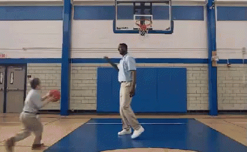

<!-- .slide: data-background="../reveal.js/img/title.png" class="center" -->

# Building Your own Widget with ArcGIS API for JavaScript

### Matt Driscoll – [@driskull](https://twitter.com/driskull)
### JC Franco – [@arfncode](https://twitter.com/arfncode)

---

# Agenda

- About Widgets
- Prerequisites
- Widget framework
- Theming
- DO IT!
- Tips & tricks


---

# About Widgets

- What?
  - Encapsulated
  - Cohesive
  - Single-purpose pieces of functionality
- Why?
  - Reusable
  - Interchangeable
- How?
  - Different frameworks are available

---

# Prerequisites

- Accessor
- TypeScript


---

## Accessor

- JavaScript API Foundation
- Consistent developer experience
- TypeScript support

---

## Accessor - Unified Object Constructor

```js
var view = new MapView({
  container: "viewDiv",
  map: map
});

var symbol = new SimpleMarkerSymbol({
  style: "square",
  color: "blue"
});

var widget = new BasemapToggle({
  view: view,
  nextBasemap: "hybrid"
});
```

---

## Accessor - Defining Properties (getters + setters)

```js
var Foo = Accessor.createSubclass({
  properties: {

    // read-only
    foo: { readOnly: true, value: new Foo() },

    // aliased
    bar: { aliasOf: "foo" },

    // autocast
    baz: { type: SomeClass }
  }
});
```

---

## Accessor - Property watching

```js
// watch for changes using a property chain
view.watch("map.basemap.title", handleTitleChange);

// watch for changes to multiple properties
view.watch("stationary, interacting", handleViewPropChange);
```

---

# TypeScript

- Superset of JavaScript
- Compiled to JavaScript
- Statically type-checked
- Syntactic sugar... sweet!
  - Use ES6 syntax while targeting ES5 environments


---

# TS = type safety

```ts
let view: MapView | SceneView;

// ...

/*
 * TS2322: Type '"not-a-view"' is not assignable
 * to type 'MapView | SceneView'.
 */
view = "not-a-view";
```



---

# Typings!

Help describe what things are:

```ts
type PresenterNames = "Alan" | "Matt" | "JC";

interface Person {
  name: string;
  age: number;
}

interface Presenter extends Person {
  name: PresenterNames;
}
```

---

# Decorators!

- Enhance classes, properties, methods, parameters

```ts
class Foo extends declared(Accessor) {

  // read-only
  @property({ readOnly: true })
  foo = new Foo();

  // aliased
  @property({ aliasOf: "foo" })
  bar;

  // autocast
  @property({ type: SomeClass })
  baz;
}
```

---

# TypeScript Environment

- Visual Studio Code
- IntelliJ IDEA/WebStorm
- Text editor + command line

---

# TypeScript + JS API 4

- Set up TS
- JavaScript API typings

---

# Key `Accessor` decorators

- `subclass`
- `declared`
- `property`

---

# Widget framework

- JSX
- Lifecycle
- Properties
- Methods
- Events

---

# Framework: About

`esri/widgets/Widget`: Our new widget framework

- Accessor-based
- Built with TypeScript


---

# Framework: JSX

- JavaScript extension **syntax**
- Looks similar to HTML
- Can use JS inline!

```xml
<div class={classLookup.hello} onclick={this._handleClick}
     tabIndex={0}>Hello</div>
```

---

# Framework: Lifecycle

  - constructor
  - postInitialize
  - render
  - destroy

---

# Framework: Properties

  - watching
  - renderable
  - Types
  - dependsOn
  - readOnly
  - set()
  - get()
  - aliasOf
  - vmEvent

---

# Framework: ViewModels

TBD

---

# Framework: Views

TBD

---

# Framework: Methods

TBD

---

# Framework: Events

TBD

---

# Framework: i18n

TBD

---

# Theming

- Out of the box
- SASS


---

# Theming: Out of the box

TBD


---

# Theming: SASS

TBD

---

# Theming: BEM

TBD

---

# DO IT!

Build a widget!


---

# Tips & Tricks

- collections
- Accessibility
- i18n


---

## Additional Resources

- [Styling](https://developers.arcgis.com/javascript/latest/guide/styling/index.html)
- [Implementing Accessor](https://developers.arcgis.com/javascript/latest/guide/implementing-accessor/index.html)
- [Setting up TypeScript](https://developers.arcgis.com/javascript/latest/guide/typescript-setup/index.html)
- [Widget Development](https://developers.arcgis.com/javascript/latest/guide/custom-widget/index.html)
- [JavaScript Sessions at DevSummit](https://devsummit.schedule.esri.com/#search/sessions/q:javascript)
- [Documentation - 4.3](https://developers.arcgis.com/javascript/)


---

# Use the source luke

[GitHub Code](https://github.com/jcfranco/devsummit-2016-building-widgets)


---

# Please Take Our Survey!

1. Download the Esri Events app and go to DevSummit
2. Select the session you attended
3. Scroll down to the "Feedback" section
4. Complete Answers, add a Comment, and Select "Submit"


---

# Questions?


---

# Thank you!


---

<!-- .slide: data-background="../reveal.js/img/end.png" -->
